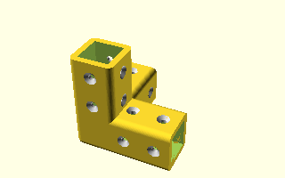

# AlEx

Library of 3D printed parts to aid construction projects using Aluminium (Aluminum) extrusions.


Example of a 3 axis orthonogal corner join:

```
use <lib_alex.scad>
use <lib_screw.scad>
$fn = 60;
AlEx_corner_join(ALD=20, L=60, M=4, T=4);

```

## Corner join (3 axis orthonogal)




